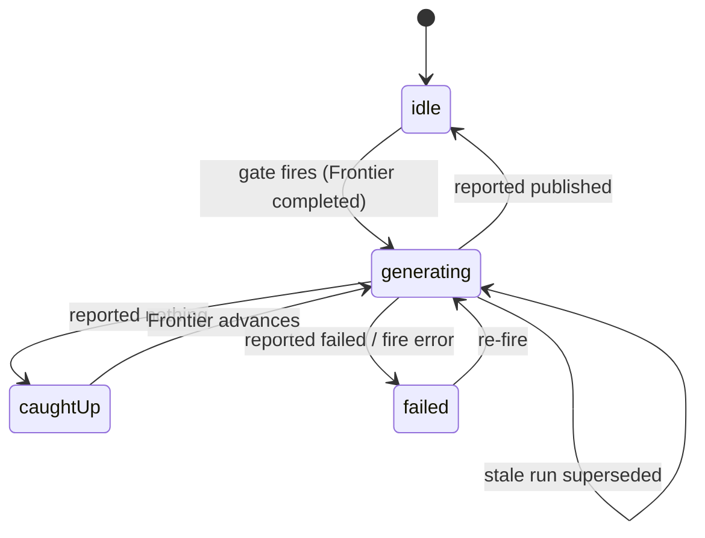

# Teaching Routine

The [[Routine]] is the compute that authors the *next* [[Lesson]]. It is a cloud-hosted Claude Code
agent (a swappable adapter — [ADR 0010](/docs/adr/0010-teaching-compute-swappable-adapter.md)) fired
either by a daily Convex cron or the [Reader](02-reader.md)'s button. Crucially, **the decision to
fire lives in Convex** ([ADR 0008](/docs/adr/0008-next-lesson-routine-gate-in-convex.md)); the agent
itself is topic-agnostic and learns what to work on at runtime. All logic is in
[routine.ts](/convex/routine.ts).

## The gate & lock (the `generation` table)

One [`generation`](/convex/schema.ts#L131-L150) row per Topic is a single-flight lock with a small
state machine:

- **Gate:** [`tryAcquireGeneration`](/convex/routine.ts#L92-L140) atomically decides *and* locks. It
  fires only if the [[Frontier]] ([`frontierLesson`](/convex/routine.ts#L34-L42), the highest-seq
  non-superseded lesson) is `completed` by the owner ([`isCompleted`](/convex/routine.ts#L44-L52)) —
  or, the bootstrap case, the Topic is `seeded` with no Frontier yet (fires once on key `"(seed)"`).
- **Fire:** [`fireForTopic`](/convex/routine.ts#L210-L239) POSTs the external Routine URL with an
  **empty body** ([ADR 0008](/docs/adr/0008-next-lesson-routine-gate-in-convex.md) — the fire body is
  closed). On a fire error it calls `failGeneration` to release the lock.
- **Claim:** the fired run calls [`claimWork`](/convex/routine.ts#L189-L202) with its `runId`; this
  hands it the oldest locked-but-unclaimed Topic. This is how a closed fire body still serves many
  Topics — and how `fire-all` gives each concurrent run a distinct one.
- **Report:** [`reportGeneration`](/convex/routine.ts#L159-L181) closes the loop with `published`
  (→ `idle`, Frontier advanced), `nothing` (→ `caughtUp`, debounced), or `failed`.

## What fires it

- **Daily cron** — [crons.ts](/convex/crons.ts#L11) at `23 4 * * *` (04:23 UTC) calls
  [`dailyFire`](/convex/routine.ts#L276-L284) for every ready Topic. Most days this is a no-op by
  design (nobody's Frontier moved). This is the **primary** authoring path.
- **Reader button** — [`requestNextLesson`](/convex/routine.ts#L242-L248), `manual: true`, rate-limited
  to once per 20h per Topic; the setup/seed button is [`requestSetup`](/convex/routine.ts#L256-L262).
- The external Fire endpoint itself is the claude.ai Routine (`ROUTINE_FIRE_URL` / `_TOKEN`), **not in
  this repo**. [http.ts](/convex/http.ts) only mounts auth routes.

## What the agent does

`docs/routine-prompt.md` is the verbatim instruction block pasted into the claude.ai Routine;
`docs/routine.md` is the operational runbook. The loop: `claim` a
Topic → `materialise` its context → run the teach skill → draft the [[Mission]] if needed → review &
[[Reply|reply]] to open [[Question]]s → author **one** Lesson → `publish` → `report`. It never commits
to git — content goes to the Hub ([ADR 0009](/docs/adr/0009-content-source-of-truth-in-convex-routine-pulls-context.md)).
The mechanics are the [Publishing & Workspace](04-publishing-workspace.md) scripts.

## Gotchas

- **Stale-run backstop.** A `generating` row older than `STALE_MS` (10 min,
  [routine.ts:112](/convex/routine.ts#L108-L118)) is treated as crashed and re-fireable; the zombie
  run's late report no-ops.
- **`caughtUp` debounce.** Reporting `nothing` pins `frontierKey`; the gate refuses to re-fire that
  exact Frontier until the learner advances it — so the agent isn't hammered when there's nothing to add.
- **One Routine for all Topics.** A single topic-agnostic agent; Topic is resolved via `claimWork`, not
  passed in. Concurrency is safe via `startedAt` ordering.
- **Manual cooldown survives reports.** `lastManualFireAt` is never cleared by `reportGeneration`, so the
  20h button cooldown holds across runs ([routine.ts:121](/convex/routine.ts#L121-L134)).
