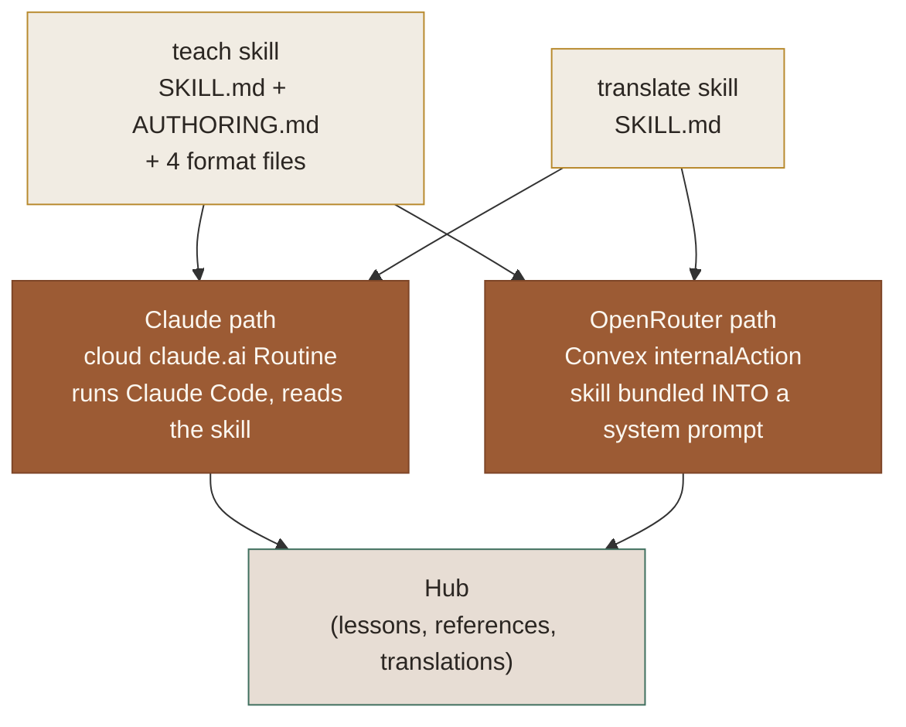

# Teaching Intelligence

This is the **prompt-engineering layer** — the part of the app that is a language model doing a job,
not code. Everything a model reads or is told lives here: the pedagogy doctrine, the system prompts, the
structured-output contracts, the grounding rules, and the guardrails that keep an authored [[Lesson]]
trustworthy. The [Teaching Routine](03-teaching-routine.md) is the *when* (a Convex gate decides to
fire); this is the ***what the model is told*** once it runs.

One doctrine, **two runtimes** ([ADR 0014](/docs/adr/0014-provider-agnostic-teaching-runtime-two-lines.md)):

- **Claude path.** A cloud [[Routine]] runs Claude Code, clones the repo, and reads the skill files off
  disk. Its Instructions field is the [Routine system prompt](/docs/routine-prompt.md); the skill is the
  judgement it follows. Full agentic loop, filesystem, tools.
- **OpenRouter path** ([ADR 0014](/docs/adr/0014-provider-agnostic-teaching-runtime-two-lines.md)). The
  *same* skill text is bundled into a system prompt and sent to an OpenAI-compatible model in a single
  pass with **no filesystem** — the model returns one JSON object, and Convex publishes it. This is the
  "BYOK / configure-it-yourself" line; Claude is the "Managed" line.

Both are grounded in the same prose. **That prose is the product** — the sections below are a guided
tour of it.

## The `teach` skill — pedagogy as a prompt

[`.agents/skills/teach/SKILL.md`](/.agents/skills/teach/SKILL.md) is the teaching judgement. It is not a
list of steps; it encodes a small learning-science model the author must reason with:

- **Knowledge / Skills / Wisdom** taxonomy — what to teach, how, and when to hand off to a community.
- **Fluency vs. Storage Strength.** The doctrine explicitly distrusts the easy win:

  > Fluency can give the user an illusory sense of mastery, but storage strength is the real goal. Try
  > to design lessons which build long-term retention by desirable difficulty: retrieval practice,
  > spacing, interleaving.

- **Zone of Proximal Development** — every lesson must challenge "just enough", inferred from the
  learner's [[Progress]], [[Response]]s and learning records.
- **Mission-grounding.** "Every lesson should be tied into the mission" — an untethered lesson is out of
  scope by definition ([[Mission]]).
- **The anti-hallucination rule**, stated flatly: **"Never trust your parametric knowledge."** Knowledge
  comes from trusted [[Resource]]s first; "Lessons should be littered with citations."
- **Aesthetic direction.** "A lesson should be **beautiful** … Think Tufte." Prompt engineering includes
  taste.

### The authoring contract — structured output in prose

[`.agents/skills/teach/AUTHORING.md`](/.agents/skills/teach/AUTHORING.md) is the mechanical half: the
exact shape a lesson must take so the [Reader](02-reader.md) can render and score it. This is a
**structured-output spec written for a model**:

- A lesson is a **LEAN FRAGMENT** — content only. The design system (`lessons/_partials/head.html`) and
  the quiz-feedback `<script>` (`foot.html`) are wrapped on at [[Publish|publish]] time, so the author
  must **not** emit `<!DOCTYPE>`, `<html>`, `<head>`, `<style>`, `<body>`, or any `<script>`.
- **Quiz markup is load-bearing and positional.** `.quiz[data-correct]`, each `.opt[data-k]`, and
  fill-in `data-answer`/`data-alt` are read by both the visual feedback script *and* the Reader's
  capture bridge. Renaming or dropping one silently breaks scoring.
- **Anti-cueing guardrail:** "Every MCQ option must be the same word count … no formatting or length
  tells that leak the answer." Balance is then enforced mechanically — publish deterministically
  shuffles option order ([`convex/quizShuffle.ts`](/convex/quizShuffle.ts),
  [ADR 0019](/docs/adr/0019-quiz-option-shuffle.md)) so `data-correct` never clusters first.
- **Grounding, again, character-for-character:** "Never trust parametric memory; verify quoted source
  text character-for-character," and reuse sources already verified rather than re-fetching.
- **Cost discipline:** §8 tells the author to read `CAPTURE.json` directly rather than re-pull learner
  state — a redundant round-trip removed from the hot path.

The four `*-FORMAT.md` siblings ([MISSION](/.agents/skills/teach/MISSION-FORMAT.md),
[LEARNING-RECORD](/.agents/skills/teach/LEARNING-RECORD-FORMAT.md),
[GLOSSARY](/.agents/skills/teach/GLOSSARY-FORMAT.md),
[RESOURCES](/.agents/skills/teach/RESOURCES-FORMAT.md)) each add a self-discipline guardrail — e.g. the
learning-record format spells out "what does *not* qualify" (coverage ≠ learning), and the resources
format is "high-trust only … if a resource is marketing dressed as education, leave it out."

## The Routine system prompt

[`docs/routine-prompt.md`](/docs/routine-prompt.md) is the canonical text pasted into the claude.ai
Routine's Instructions field — the operational system prompt for the Claude path. It opens:

> You are the TEACHER for personal learning workspaces, running unattended in the cloud — no human is
> watching this run. … One run advances ONE topic by EXACTLY ONE lesson, end to end, then reports the
> outcome. You have zero prior context; everything you need is pulled from the backend at run time.

Techniques worth calling out for anyone studying the prompt:

- **Scope clamp** — "Keep the scope to ONE lesson."
- **A `finally` block, in English** — "REPORT the outcome — ALWAYS, as the very last step, even on
  failure (treat it like a finally block)," so the [[Routine]] lock is always released.
- **Termination judgment** — end the course only when the Mission's "Success looks like" outcomes are
  substantially met or the ZPD is exhausted; **"Do NOT terminate lifelong / open-ended missions."**
- **Anti-gaming** — the `--estimate` count "is a SOFT forecast … NOT a quota — … NEVER author lessons
  just to reach it" ([ADR 0018](/docs/adr/0018-lesson-count-estimate-advisory.md)).

The operational wiring (fire endpoint, `claimWork`, the gate/lock) is the [Teaching
Routine](03-teaching-routine.md) context; the [runbook](/docs/routine.md) documents the connectors and
model (Opus, 1M context).

## The OpenRouter path — the skill as a literal system prompt

The provider-agnostic line ([ADR 0014](/docs/adr/0014-provider-agnostic-teaching-runtime-two-lines.md))
runs the whole thing inside a Convex `internalAction` with no filesystem. Three modules matter:

- **[`convex/openrouterClient.ts`](/convex/openrouterClient.ts#L20-L21)** — the OpenRouter model client
  (authoring, and the translation *rollback* path). Defaults (env-overridable): author `z-ai/glm-4.7`,
  translate `google/gemini-3.5-flash`. Notable params: `webSearch` toggles OpenRouter's `web` plugin for
  grounded generation; `reasoning: "none"` *asks* to disable billed thinking. It retries once without
  `reasoning` if an endpoint mandates it — a resilience guardrail, but for Gemini that retry silently
  turns thinking back **on**, which is exactly why translation moved off it (see below).
- **[`convex/geminiClient.ts`](/convex/geminiClient.ts)** — the native Google AI Studio client, used
  **only** by the translate path. Same dependency-free `fetch` seam; hits the Gemini Developer API's
  `:generateContent` with `GOOGLE_AI_API_KEY` and `thinkingConfig.thinkingBudget: 0`, which the native API
  actually honours (unlike OpenRouter's unified toggle — translation-cost 05). Default model
  `gemini-3.5-flash`, overridable via `GEMINI_TRANSLATE_MODEL`. Which client runs translation is the
  per-deployment `TRANSLATE_PROVIDER` switch (`gemini` default | `openrouter` rollback).
- **[`convex/authoring.ts`](/convex/authoring.ts#L203-L240)** — where the skill becomes a prompt. The
  system message is `TEACH_INSTRUCTIONS` (the bundled skill) **+** an `OUTPUT_CONTRACT`:

  > You are running in a single pass with NO filesystem — you cannot write files or run tools. Instead
  > of writing lesson/record files, return EXACTLY ONE JSON object and nothing else …

  Its fields (`complete`, `lessonHtml`, `learningRecord`, `estimatedLessons`, `replies[]`,
  `references[]`) re-express the file-based contract as JSON. The user message is
  [`serializeContext`](/convex/authoring.ts#L246) — mission/seed, prior-lesson titles, the **full
  Frontier lesson HTML** as a style/continuity anchor, learning records, references, the learner's
  primary [[Resource]]s, and their captured quiz responses and open [[Question]]s.
- **[`convex/openrouter.ts`](/convex/openrouter.ts)** — orchestration. Bootstrap (seeded course) drafts
  the [[Mission]] then Lesson 1, both **web-grounded**; ongoing runs make one call, no web search.
  Guardrails: generation completes before any publish (a failed run stays retryable), and a hallucinated
  reply `questionId` not in the known open set is ignored.

Two anti-chatter guardrails backstop the model: [`parseFencedJson`](/convex/authoring.ts#L67) tolerates a
stray code fence or a sentence of narration around the JSON, and only replies to real question ids.

### Keeping the two prompts from drifting

The OpenRouter system prompt is not hand-maintained. [`scripts/bundle-authoring-assets.ts`](/scripts/bundle-authoring-assets.ts)
compiles the six `teach` docs (in prompt order) plus the three `lessons/_partials/*.html` into
[`convex/authoringAssets.generated.ts`](/convex/authoringAssets.generated.ts) (`TEACH_INSTRUCTIONS`,
`LESSON_HEAD`, `LESSON_FOOT`, `REFERENCE_HEAD`). It writes only on change so CI can assert freshness — so
the skill on disk is the single source of truth for **both** runtimes.

## The `translate` skill — fidelity as the whole point

Rendering a completed course into another language is a sibling Routine with its own prompt,
[`.agents/skills/translate/SKILL.md`](/.agents/skills/translate/SKILL.md). Its defining constraint is a
**preserve-vs-translate contract**, because quiz scoring is *positional*:

> Translate the prose a **learner** reads. Leave two things byte-for-byte unchanged: everything the
> **scorer** reads … and the **object of study**, the material the course teaches.

- **Preserve exactly:** every tag/attribute/`class`/`id`, element order, every scoring marker
  (`data-correct`, `.opt` `data-k`, `data-answer`/`data-alt`), every `<script>`/`<style>`, and the
  object of study — the language being taught, code, proper nouns.
- **Translate:** visible prose, `<title>`, human-readable `alt`/`placeholder`/`aria-label`, and quiz
  feedback. Study-science jargon ("storage strength", "spacing") *is* learner-read prose — translate it
  even when highlighted. The decision rule: "a source-language token is prose → translate it; a
  target-language token is the object of study → keep it."
- **Anti-hallucination for scripture:** quote a published translation in the target language rather than
  back-translate the English yourself; if none is reliably available, leave the passage in the source
  language "rather than invent one."

The **in-Convex** translate prompt ([`convex/translate.ts`](/convex/translate.ts#L519-L536)) is the
compressed version: *"You are a professional translator. … Preserve EVERY HTML tag, attribute, and value
EXACTLY — especially quiz markers … Return ONLY the translated HTML, with no code fence and no
commentary."* It runs with thinking disabled for cost — `thinkingBudget: 0` on the default native Gemini
path (`reasoning: "none"` on the OpenRouter rollback) — and strips `<script>`/`<style>` before sending so
the model only sees real content.

## Where each artifact lives

| Layer | Artifact | Opens as |
| --- | --- | --- |
| Pedagogy doctrine | [`teach/SKILL.md`](/.agents/skills/teach/SKILL.md) (+ 4 format files) | inline page |
| Mechanical / output contract | [`teach/AUTHORING.md`](/.agents/skills/teach/AUTHORING.md) | inline page |
| Translation fidelity | [`translate/SKILL.md`](/.agents/skills/translate/SKILL.md) | inline page |
| Claude-path system prompt | [`docs/routine-prompt.md`](/docs/routine-prompt.md) | inline page |
| OpenRouter output contract | [`convex/authoring.ts`](/convex/authoring.ts#L203-L240) | code drawer |
| Model client / params (OpenRouter) | [`convex/openrouterClient.ts`](/convex/openrouterClient.ts) | code drawer |
| Translate client (native Gemini) | [`convex/geminiClient.ts`](/convex/geminiClient.ts) | code drawer |
| Translation prompt (in-app) | [`convex/translate.ts`](/convex/translate.ts#L519-L536) | code drawer |
| Drift-proofing bundler | [`scripts/bundle-authoring-assets.ts`](/scripts/bundle-authoring-assets.ts) | code drawer |

All of these are also in the **AI Agent Context** group in the sidebar.

## Gotchas

- **The skill is the source of truth for both runtimes.** Edit
  [`teach/SKILL.md`](/.agents/skills/teach/SKILL.md) / `AUTHORING.md`, then re-run
  `pnpm bundle:authoring` — the OpenRouter prompt is generated, not hand-written. A skipped bundle silently
  ships a stale prompt to the OpenRouter path only.
- **Positional quiz identity is the fragile invariant** the prompts protect. The author-side rule ("keep
  the markup exactly"), the publish-side shuffle ([`quizShuffle.ts`](/convex/quizShuffle.ts)), the
  translate-side "preserve every marker", and the server-side count check in `publishTranslation` all
  guard the same thing — the Reader derives quiz ids from DOM order, not labels.
- **`routine-prompt.md` is prose, not enforced.** It references SKILL.md headings ("Terminating a
  Course", "The Lesson-Count Estimate") that currently live in PRDs/ADRs rather than the skill body —
  worth reconciling so the prompt's cross-references resolve.
- **No model runs in the app on the Claude path.** ADR 0001/0010 hold: the cloud run owns Claude access.
  Only the in-Convex **authoring/translate** actions call a model directly. Keys on the deployment:
  `OPENROUTER_API_KEY` (authoring, always; translation when `TRANSLATE_PROVIDER=openrouter`) and
  `GOOGLE_AI_API_KEY` (translation on the default native-Gemini path).
