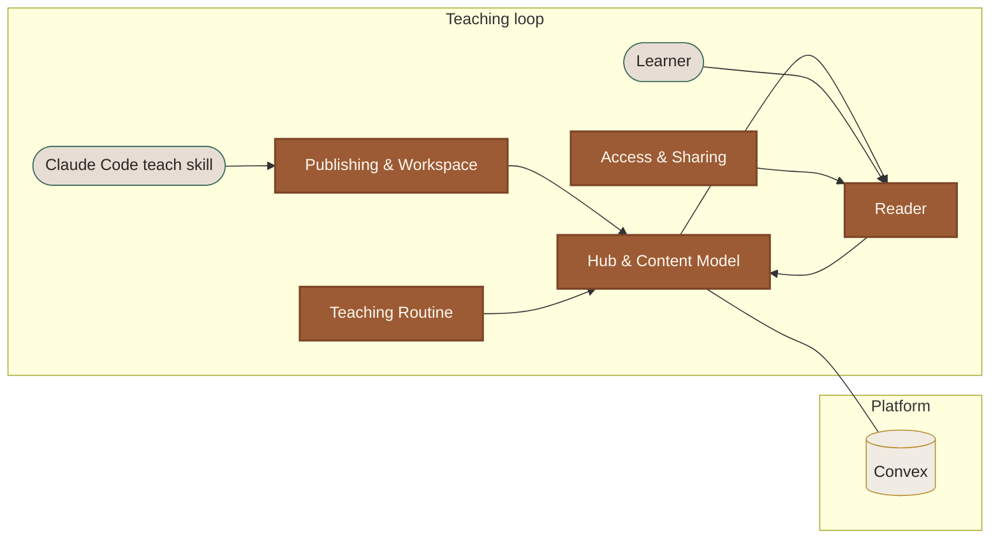

# Served Teach App — Technical Overview

An app that serves **Lessons** (self-contained HTML artifacts authored by Claude Code's teach skill)
to the web and feeds learner interactions back to Claude Code — an asynchronous, hub-mediated
teaching loop ([ADR 0001](/docs/adr/0001-asynchronous-hub-mediated-teaching-loop.md)). The short
version of the core flow:

> Claude Code (the **Routine**) authors Lessons and writes them to the **Hub** (Convex, the source of
> truth — [ADR 0009](/docs/adr/0009-content-source-of-truth-in-convex-routine-pulls-context.md)). A
> learner opens the **Reader**, works through the **Frontier** lesson, and leaves **Responses** and
> **Questions**. Completing the Frontier fires the Routine to author the next one. **Access & Sharing**
> gates who may sign up (the **Allowlist**) and who may read a Topic (**Shares**).

## What this site is

A drill-down view of the system. Each box in the **System map** below is a _domain context_ — a
bounded slice with its own model, key files, and gotchas. Click a box to zoom in. The sidebar holds
the navigation; press **g** for the searchable glossary; hover any dashed-underlined term in prose for
an inline definition.

If you're new, read the root [`CONTEXT.md`](/CONTEXT.md) glossary first, then come back here.

## System map

**How to read this map.** Click any rust box to jump into that context's panel. Rust = domain context;
sand = platform; pale = external actor. The mermaid node ids (`HUB`, `READER`, `ROUTINE`, `PUB`,
`ACCESS`) are the keys of `NODE_TO_SLUG` in `index.html` — that's what makes the boxes clickable, so
keep them in sync.

## Reading order

| If you're…                       | Read…                                                                                            |
| -------------------------------- | ------------------------------------------------------------------------------------------------ |
| New to the codebase              | Root [`CONTEXT.md`](/CONTEXT.md) → this page → [Hub & Content Model](contexts/01-hub-content.md). |
| Working on what a learner sees   | [Reader](contexts/02-reader.md).                                                                  |
| Touching how lessons get authored| [Teaching Routine](contexts/03-teaching-routine.md) + [Publishing & Workspace](contexts/04-publishing-workspace.md). |
| Working on sign-up / sharing     | [Access & Sharing](contexts/05-access-sharing.md).                                                |
| Hunting an ADR for a decision    | Sidebar Reference → ADRs.                                                                         |
